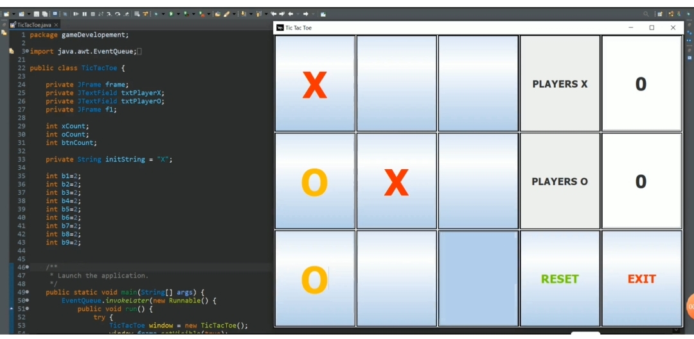

# 🎮 Tic Tac Toe (Java Swing)


This is my first project built using *Java Swing*.  
It’s a simple two-player Tic Tac Toe game with a scoreboard, reset, and exit options.

---

## ✨ Features
- Two-player mode (Player X vs Player O)  
- Scoreboard to keep track of wins  
- Reset button to restart the game  
- Exit button to quit  

---

## 🚀 How to Run
1. Clone this repository  
   ```bash
   git clone https://github.com/YourUsername/TicTacToe-Game.git
2. Open the project in your IDE (IntelliJ, Eclipse, etc.)  
3. Run the main() method inside TicTacToe.java  
4. Start playing 🎉  

---

## 📸 Screenshot


---

## 🔮 Future Improvements
- Add AI opponent  
- Improve UI design  
- Add single-player mode
